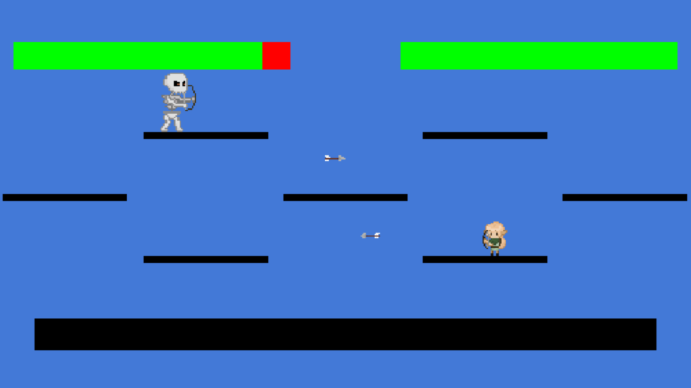

**Description**

*M.E.T.A.!* est une série de cinq combats séparés par des *patchs* qui introduisent de nouvelles fonctionnalités à chaque niveau. Le joueur se déplace, attaque et utilise des compétences spéciales via le clavier. En lien avec la thématique de la métamorphose (Mystères de l'UNIL), le jeu invite à réfléchir à comment nos choix nous transforment, extérieurement et intérieurement.

Fonctionnalités :
- Combats avec des ennemis aux comportements distincts (poursuite, téléportation, tir de projectiles),
- Patchs avec rajout de nouvelles compétences (armes, créatures, mouvements, boosts),
- Système de barres de vie, cooldowns, collisions, etc.
- Scènes narratives de réflexion à la fin du jeu.

**Procédure d'installation**

Le jeu est jouable directement en ligne sur itch.io : https://lousuol.itch.io/meta. Pour lancer le projet en local, téléchargez 'kaplay8.0.zip', et lancez index.html dans un navigateur sur Live Server (fichiers nécessaires : index.html, main.js et fichier assets).

**Modules, librairies ou scripts nécessaires**

Aucune installation n'est nécessaire : la librairie Kaplay.js (3001.0.19) est importée directement dans le main.js.

**Copyrights, informations de licence, et autres références**

- Sprite du personnage principal : inspiré des travaux de @fiopico sur X.
- Sprite du 5ème ennemi : inspiré d'une oeuvre de @GermanioArt trouvée sur Reddit.
- Sprite de l'explosion finale : inspiré d'une image trouvée sur iStock.
- Police HappyFont : https://kaplay.itch.io/happy, trouvé sur itch.io.

**Recours aux LLM**

Ce projet a eu recours à Claude Sonnet 4.6 (claude.ai) principalement pour la relecture (identification de bugs, amélioration de la lisibilité) et la compréhension (documentation Kaplay) du code.

Prompts essentiels : 
- "Aide moi à comprendre simplifier cette fonction *skeletonFight* : *copié collé du code*."
- "Sans le modifier tu peux me dire qu'est ce qui ne marche pas dans mon code ? Car quand j'appuies sur 'k' ça ne fait rien."
- "Que fait arrow.onUpdate(() => arrow.move(player.pos.sub(arrow.pos).unit().scale(150))); ?"

**Contexte de développement**

Ce projet a été développé dans le cadre du cours Développement de jeux vidéo 2D dispensé par Isaac Pante (SLI, Lettres, UNIL).
